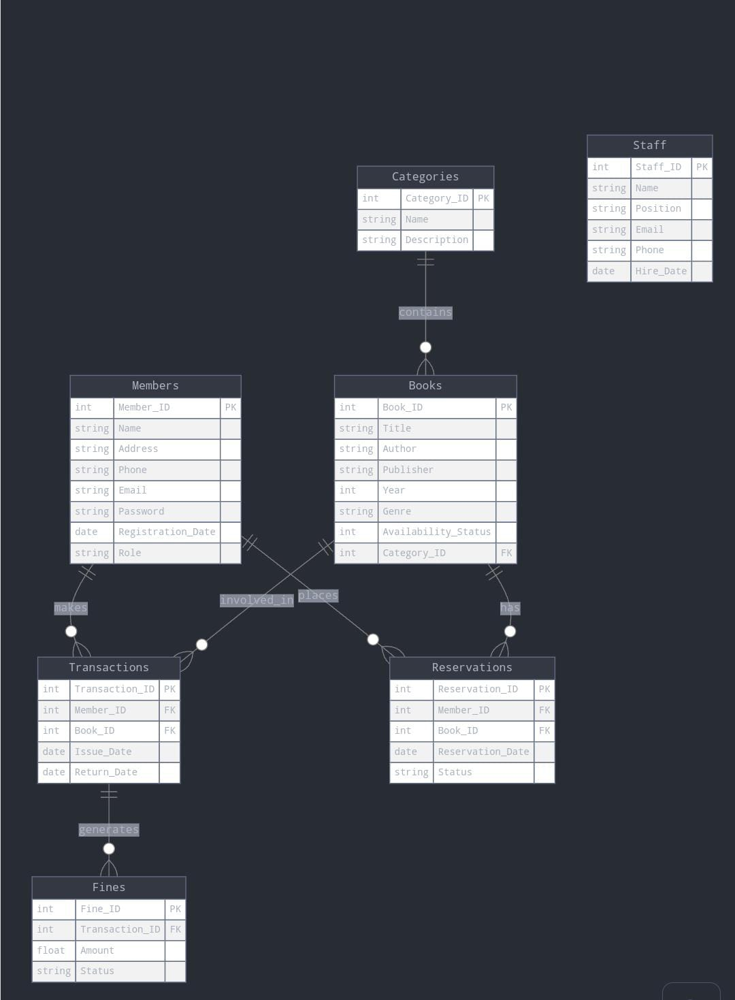

# Library Management System - UML Diagram and Tables

This project is a library management system implemented using SQLite. Below are the details of the UML diagram and corresponding database tables.

## UML Diagram

The UML diagram represents the following entities:

1. **Members**
2. **Books**
3. **Transactions**
4. **Staff**
5. **Fines**
6. **Reservations**

### UML Schema

1. **Members**

   - `Member_ID` (Primary Key)
   - `Name`
   - `Address`
   - `Phone`
   - `Email` (Unique)
   - `Password`
   - `Registration_Date`
   - `Role`

2. **Books**

   - `Book_ID` (Primary Key)
   - `Title`
   - `Author`
   - `Publisher`
   - `Year`
   - `Genre`
   - `Availability_Status`

3. **Transactions**

   - `Transaction_ID` (Primary Key)
   - `Member_ID` (Foreign Key referencing `Members(Member_ID)`)
   - `Book_ID` (Foreign Key referencing `Books(Book_ID)`)
   - `Issue_Date`
   - `Return_Date`

4. **Staff**

   - `Staff_ID` (Primary Key)
   - `Name`
   - `Position`
   - `Email` (Unique)
   - `Phone`
   - `Hire_Date`

5. **Fines**

   - `Fine_ID` (Primary Key)
   - `Transaction_ID` (Foreign Key referencing `Transactions(Transaction_ID)`)
   - `Amount`
   - `Status` (Paid/Unpaid)

6. **Reservations**
   - `Reservation_ID` (Primary Key)
   - `Member_ID` (Foreign Key referencing `Members(Member_ID)`)
   - `Book_ID` (Foreign Key referencing `Books(Book_ID)`)
   - `Reservation_Date`
   - `Status` (Active/Completed)

## Database Schema (SQLite Tables)

### Table: Members

```sql
CREATE TABLE Members (
  Member_ID INTEGER PRIMARY KEY AUTOINCREMENT,
  Name TEXT,
  Address TEXT,
  Phone TEXT,
  Email TEXT UNIQUE,
  Password TEXT,
  Registration_Date DATE,
  Role TEXT
);


CREATE TABLE Books (
  Book_ID INTEGER PRIMARY KEY,
  Title TEXT,
  Author TEXT,
  Publisher TEXT,
  Year INTEGER,
  Genre TEXT,
  Availability_Status INTEGER,
  Category_ID INTEGER,
  FOREIGN KEY (Category_ID) REFERENCES Categories(Category_ID)
);


CREATE TABLE Transactions (
  Transaction_ID INTEGER PRIMARY KEY,
  Member_ID INTEGER,
  Book_ID INTEGER,
  Issue_Date DATE,
  Return_Date DATE,
  FOREIGN KEY (Member_ID) REFERENCES Members(Member_ID),
  FOREIGN KEY (Book_ID) REFERENCES Books(Book_ID)
);


CREATE TABLE Staff (
  Staff_ID INTEGER PRIMARY KEY AUTOINCREMENT,
  Name TEXT,
  Position TEXT,
  Email TEXT UNIQUE,
  Phone TEXT,
  Hire_Date DATE
);


CREATE TABLE Fines (
  Fine_ID INTEGER PRIMARY KEY AUTOINCREMENT,
  Transaction_ID INTEGER,
  Amount REAL,
  Status TEXT,
  FOREIGN KEY (Transaction_ID) REFERENCES Transactions(Transaction_ID)
);


CREATE TABLE Reservations (
  Reservation_ID INTEGER PRIMARY KEY AUTOINCREMENT,
  Member_ID INTEGER,
  Book_ID INTEGER,
  Reservation_Date DATE,
  Status TEXT,
  FOREIGN KEY (Member_ID) REFERENCES Members(Member_ID),
  FOREIGN KEY (Book_ID) REFERENCES Books(Book_ID)
);


CREATE TABLE Categories (
  Category_ID INTEGER PRIMARY KEY AUTOINCREMENT,
  Name TEXT UNIQUE,
  Description TEXT
);
```

## ER-Diagram of Library-app


